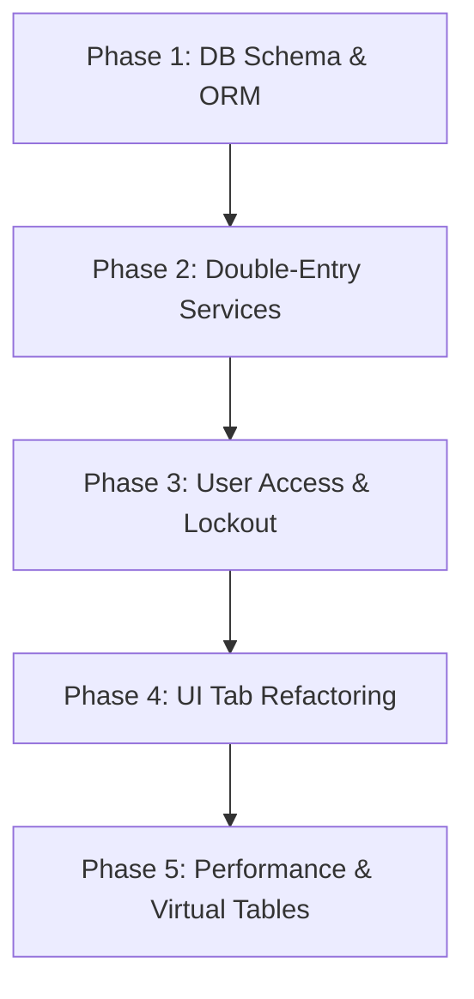

# Master Plan: SuperERP Core Codebase Upgrade

This document outlines the step-by-step roadmap to upgrade the Hollow Concrete Block (HCB) Factory Manager into an audit-ready, double-entry **SuperERP** supporting the 8 core vouchers.

---

## 📅 Roadmap Overview

We will execute the upgrade in 5 sequential phases to ensure codebase stability.

---

## 🛠 Phase-by-Phase Execution

### **Phase 1: Database Migration & Schema Setup (SQLAlchemy)**
* **Goal**: Establish the SQLAlchemy database connection, replacing the raw SQLite cursors. Enable Write-Ahead Logging (WAL) mode for local performance.
* **Key Tasks**:
  1. Define database tables in a new file `app/database/models.py`:
     * `articles` (soft delete, categories, prices).
     * `vouchers` (transaction headers).
     * `inventory_ledger` (immutable movements).
     * `journal_entries` (debit/credit balancing).
     * `users` & `permissions` (UAC mapping).
  2. Implement schema generation and migrations in `app/database/db.py`.
  3. Update `app/database/seed.py` with standard articles and UAC permission preset profiles.

### **Phase 2: Service Layer & Double-Entry Ledger Implementation**
* **Goal**: Refactor the inventory/sales backend to use the **Double-Entry Ledger Pattern** (Option B).
* **Key Tasks**:
  1. Create `app/services/ledger_service.py` to post transaction entries.
  2. Rewrite production logic: Consolidate mixing calculations and stock shifts into a single **Production Voucher** transactional post.
  3. Implement the `void_voucher` routine to run reversing compensating ledger transactions.

### **Phase 3: User Access Control (UAC) & Auto-Lockout**
* **Goal**: Build fine-grained permission-based restrictions and auto-lockout security gates.
* **Key Tasks**:
  1. Update authentication handlers to check action-level permissions (e.g., `sale:create`, `system:void`).
  2. Create a global PyQT5 event filter or timer that monitors user idle time.
  3. Force-display a modal lock screen after 120 seconds of inactivity.

### **Phase 4: PyQt5 UI View Restructuring**
* **Goal**: Re-layout the UI tabs in `main_window.py` to match the 8 core vouchers.
* **Key Tasks**:
  1. Group UI into 5 main sidebar views: Dashboard, Logistics, Production, Sales, and User/Audits.
  2. Bind GUI action buttons and sub-menus to current user permission checks.

### **Phase 5: Performance Optimization (Virtual Tables)**
* **Goal**: Solve the dataset loading bottleneck for large transaction logs.
* **Key Tasks**:
  1. Implement a pagination-friendly `QAbstractTableModel` in `app/ui/widgets/virtual_model.py`.
  2. Switch list widgets to `QTableView` with SQL `LIMIT` and `OFFSET` queries.
